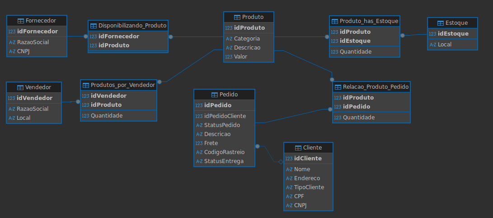

# 🛒 E-Commerce Modelagem de banco de dados - DIO & Klabin

Este projeto foi desenvolvido para o desafio de **Modelagem de Dados para E-commerce** do Bootcamp Klabin (Excel e Power BI Dashboards 2026). O objetivo foi transformar um modelo conceitual em um modelo lógico funcional, aplicando refinamentos práticos e queries analíticas.

---

## 🏗️ O Desafio
O cenário propõe um ecossistema de e-commerce completo. Além da estrutura básica, implementei os seguintes refinamentos solicitados:

- **Especialização de Clientes**: Diferenciação lógica entre **Pessoa Física (PF)** e **Pessoa Jurídica (PJ)**.
- **Gestão de Entregas**: Inclusão de status de rastreio e código de logística.

---

## 📐 Modelo EER

---

## 🛠️ Tecnologias Utilizadas
- **MySQL**: Banco de dados relacional.
- **SQL DDL**: Criação de tabelas, chaves primárias e estrangeiras.
- **SQL DML**: Persistência de dados para testes de consistência.
- **Lógica de Negócios**: Definição de Constraints e integridade referencial.

---

## 🔍 Consultas de Negócio (Queries)

O projeto conta com queries complexas que respondem a perguntas essenciais para a gestão do E-commerce:

1.  **Gasto total**: Identifica o valor total gasto por cliente.
2.  **Gestão de Estoque**: Relaciona produtos, fornecedores e estoques por localidade.
3.  **Conflito de Interesse**: Verifica se algum Vendedor também atua como Fornecedor.
4.  **Status de Logística**: Filtra pedidos que já possuem código de rastreio mas ainda estão em trânsito.

> **Dica**: Os scripts estão divididos em `esquema.sql` (criação), `dados.sql` (inserção) e `analise.sql` (consultas).

---

